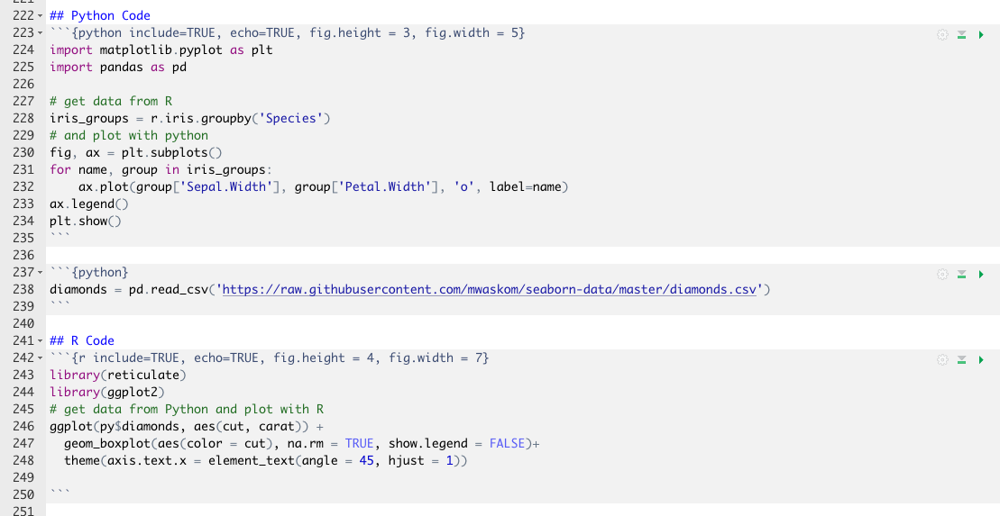

```{r setup, include=FALSE}
knitr::opts_chunk$set(echo = FALSE,
                      eval = TRUE,
                      results = 'asis')
# make sure python3 is used
library(reticulate)
use_python("/usr/bin/python3")


# knitr::knit_engines$set(python=reticulate::eng_python)
library(tableHTML)
```


## Contents

- Background - why we are talking about it
- Ways of closing the gap
  + Feather
  + Apache Arrow
  + Ursa Labs
  + Rstudio 1.2 / reticulated python
- Conclusion

## Background

- There is an argument in the data science space
- Can be observed by countless articles / blog posts etc on R vs Python
- <strong>BUT</strong>: this argument is not very helpful and divisive
- Focus should be on the task at hand, not the tools
  + you can drill a hole with a hammer, but it won't be elegant
- Both tools have strengths and weaknesses (not part of this talk)
- You are here to solve a problem, not to have a favourite algorithm or tool
  
## Reality check

KD Nuggets Poll 2018: most of the people who use Python or R use both 

 <div class="flex_layout">
  <div class="flex_column">
  
```{python, fig.height = 4, fig.width = 4.5}
from collections import Counter

import matplotlib.pyplot as plt
from matplotlib_venn import venn2, venn2_circles

sets = Counter()
sets['01'] = 578
sets['11'] = 924
sets['10']  = 592
setLabels = ['Python', 'R']

c = venn2(subsets = sets,
          set_labels = setLabels)

c.get_patch_by_id('10').set_color('#125BBD')
c.get_patch_by_id('01').set_color('#366D9C')
c.get_patch_by_id('11').set_color('#FFD444')
for i in sets:
  c.get_patch_by_id(i).set_edgecolor('none')
  c.get_patch_by_id(i).set_alpha(0.6)

plt.show()
```
  </div>
  <div class="flex_column">
  <br>
  <br>
  <br>
  <br>
```{r fig.height = 1.5, fig.width = 3.5}
# dplyr::tibble('R only' = c('27.6 %'),
#            Python = c('28.7%'),
#            'R or Python Users' = c('72.7 %'),
#            N = c(2881)) %>%
  dplyr::tibble('R or Python Users' = c(2094,  '100 %'),
                'R and Python' = c(924, '44.13 %'),
                'R only' = c(578, '27.6 %'),
                'Python only' = c(592, '28.27%')) %>%
  t() %>% 
  tableHTML(headers = c('Total', 'Percent'),
            widths =  c(150, 50, 70)) %>% 
  add_theme('rshiny-blue') %>% 
  add_css_column(1:2, 
                 css = list('text-align',
                            'right !important')) %>% 
  tableHTML_to_image()
```
  </div>
</div> 

## What Python and R have in common

- A lot of data science teams use both
- both languages have rich interfaces to C / C++
- most of under-the-hood coding is done in C / C++

\

<strong style="text-align:center;">Would it not make sense to aim for interoperability?</strong>

## Feather

- Python and R use data frames as a fundamental data structure
  + Pandas data frame are based on the idea of R's data frames
- Implemented after the announcement of Apache Arrow
  + Aim: share data between Python and R 
  + Use a binary file format for data frames
  + bridge time until Apache Arrow is implemented
- Uses the Apache Arrow columnar specification to represent binary data **on disk** (zero-copy access)
- Fast, lightweight, and easy-to-use binary file format for storing data frames.
- High read and write performance.


## Limitations of Feather

- Quickly exchange data between Python and R code, however it's not designed for long-term data storage.
- Supports limited scalar value types, adequate only for representing typical data found in R and pandas
- Supports only a single batch of rows (no ability to append to existing files)
- Only non-nested data types and categorical (dictionary-encoded) types are supported

## Apache Arrow
A standarised, language-independent representation of in-memory columnar data

- Exchange data without conversion between the different languages including python and R (also C, C++, C#, Go, Java, JavaScript, MATLAB, Ruby, and Rust.)
- Zero-copy dataflow
- Optimised for analytic purposes
- Supports flat and nested format and conveniently many native data types
- Backed by key developers of 13 major open source projects (including Cassandra, Hadoop, HBase, Parquet, Spark, ... )


## Apache Arrow

```{r}
header_img <- c('</img>', 
                '</img>')
tibble::tibble(before = c('<ul> <li> Each system has its own internal memory format', 
                          '<ul> <li> 70-80% computation wasted on serialization and deserialization',
                          '<ul> <li> Similar functionaltiy implemented in multiple projects', 
                          ''), 
               after= c('<ul> <li>All systems utilize the same memory format',
                        '<ul> <li>No overhead for cross-system communication',
                        '<ul> <li>Projects can share functionality', 
                        '')) %>% 
  `names<-`(header_img) %>% 
  tableHTML(rownames=FALSE, escape = FALSE, footer = "source: arrow.apache.org") %>% 
  add_css_row(css=list('border', '1px solid transparent')) %>% 
  add_css_header(css=list('border', '1px solid transparent'), headers = 1:2) %>% 
  add_css_column(css=list('border', '1px solid transparent'), columns = 1:2)
```


## Ursa Labs

When to comes to the most fundamental tasks (data access, data manipulation, data analysis, ……. ), data science tools are not optimised to make use of state-of-the-art hardware, as the efforts has been mainly focused on machine learning problems.

- Ursa Labs is an organisation founded 
  + by Wes McKinney (and Hadley Wickham as advisor for R)
  + with the goal of advancing open source, cross-language software for data scientists
- Focuses on the data science tools of the Apache Arrow Project (Arrow has a broader application scope) 
- May expand to create software artifacts focused more specifically on the data science domain


## Rstudio 1.2 / reticulated python {.smaller}
### The package: reticulate
- Reticulate is an R package that makes it possible to embed a Python session within an R process.
- Provides wrapper functions to use python modules and scripts
    + import, python_source, repl_python, use_python, py_install, …… 
- Data conversion back and forth between the two languages happens through C++
- R and Python variables are accessible from both environments
    + The objects  py and r provide this access

## Type conversion

```{r}
r_type <- c('Single-element vector','Multi-element vector','List of multiple types',
       'Named list','Matrix/Array','Data Frame','Function','NULL, TRUE, FALSE')

py_type <- c('Scalar','List','Tuple','Dict','NumPy ndarray','Pandas DataFrame',
        'Python function','None, True, False')

ex <- c('1, 1L, TRUE, "foo"','c(1.0, 2.0, 3.0), c(1L, 2L, 3L)','list(1L, TRUE, "foo")',
        'list(a = 1L, b = 2.0), dict(x = x_data)','matrix(c(1,2,3,4), nrow = 2, ncol = 2)',
        'data.frame(x = c(1,2,3), y = c("a", "b", "c"))','function(x) x + 1','NULL, TRUE, FALSE')

source <- 'https://rstudio.github.io/reticulate/'

data.frame(R = r_type,
           Python = py_type,
           Examples = ex) %>% 
  tableHTML(rownames = FALSE,
            widths = c(200, 200, 300),
            footer = paste0("source: ", source)) %>% 
  tableHTML_to_image(zoom = 2)

```

## Rstudio 1.2 / reticulated python {.smaller}
### The IDE: Rstudio 1.2
- Automatic access to a python REPL when stepping into a python script
  + read–eval–print loop 
  + interactive language shell
  + simple, interactive computer programming environment 
- Line-by-line execution of Python code
- Support for Python syntax highlighting
- Autocompletion and Inline help for Python ...... HOOORAY!!!  
- R notebooks with Python code chunks
- Automatic switch in the code history pane between Python and R
- Sourcing full Python scripts
- Display of matplotlib plots within the plots pane in RStudio and inline in the notebooks

## R Notebooks


## Python Code 
```{python include=TRUE, echo=TRUE, fig.height = 3, fig.width = 5}
import matplotlib.pyplot as plt
import pandas as pd

# get data from R
iris_groups = r.iris.groupby('Species')
# and plot with python
fig, ax = plt.subplots()
for name, group in iris_groups:
    ax.plot(group['Sepal.Width'], group['Petal.Width'], 'o', label=name)
ax.legend()
plt.show()
```

```{python}
diamonds = pd.read_csv('https://raw.githubusercontent.com/mwaskom/seaborn-data/master/diamonds.csv')
```

## R Code
```{r include=TRUE, echo=TRUE, fig.height = 4, fig.width = 7}
library(reticulate)
library(ggplot2)
# get data from Python and plot with R
ggplot(py$diamonds, aes(cut, carat)) +
  geom_boxplot(aes(color = cut), na.rm = TRUE, show.legend = FALSE)+
  theme(axis.text.x = element_text(angle = 45, hjust = 1))

```

## Is RStudio a good alternative as a Python IDE?

- It makes switching from R to Python certainly easier
- It supports syntax highlighting and autocomplete
- It is not intended as a Python IDE (yet?)
- Since it's slightly painful, it's probably a Python IDE for data science though ;)

## Conclusion

- R <strong>*vs*</strong> Python is now R <strong>*and*</strong> Python
    + It's not about the tool, it's about the task at hand
- There are many initiatives to bring the tools closer together
    + Ursa labs => Apache Arrow
    + RStudio => Python integration
- The dogmatic war was boring before it started
- This is the time to start to embrace the strengths of the tools and to collaborate

# Questions?

## Sources
- https://towardsdatascience.com/from-r-vs-python-to-r-and-python-aa25db33ce17
- https://www.kdnuggets.com/2017/06/ecosystem-data-science-machine-learning-software.html/2
- http://ursalabs.org/tech/
- http://wesmckinney.com/blog/feather-arrow-future/
- https://arrow.apache.org/

