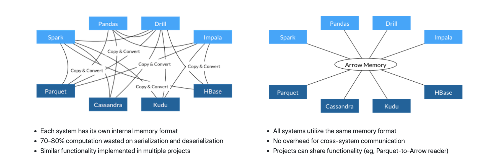

## Contents

- Background?
- Feather
- Ursa / Apache Arrow
- Rstudio 1.2 / reticulated python

## Why?

- A lot of data science teams use both
- both languages have rich interfaces to C++
- most of under-the-hood coding is done in C++

## Feather

## Apache Arrow
A standarised representation of tabular data (columnar data) in the RAM

- Exchange data without conversion between the different languages including python and R (also C, C++, C#, Go, Java, JavaScript, MATLAB, Ruby, and Rust.)
- Zero-copy dataflow
- Optimised for analysing purposes 
- Flat and nested format
- More native datatypes than python ---> and everything is nullable

## Apache Arrow

<!--html_preserve-->
<table style="border-collapse:collapse;" class=table_3197 border=1>
<caption id="footer" align="bottom">source: arrow.apache.org</caption>
<thead>
<tr style="border:1px solid transparent;">
  <th id="tableHTML_header_1" style="border:1px solid transparent;"></img></th>
  <th id="tableHTML_header_2" style="border:1px solid transparent;"></img></th>
</tr>
</thead>
<tbody>
<tr style="border:1px solid transparent;">
  <td id="tableHTML_column_1" style="border:1px solid transparent;"><ul> <li> Each system has its own internal memory format</td>
  <td id="tableHTML_column_2" style="border:1px solid transparent;"><ul> <li>All systems utilize the same memory format</td>
</tr>
<tr style="border:1px solid transparent;">
  <td id="tableHTML_column_1" style="border:1px solid transparent;"><ul> <li> 70-80% computation wasted on serialization and deserialization</td>
  <td id="tableHTML_column_2" style="border:1px solid transparent;"><ul> <li>No overhead for cross-system communication</td>
</tr>
<tr style="border:1px solid transparent;">
  <td id="tableHTML_column_1" style="border:1px solid transparent;"><ul> <li> Similar functionaltiy implemented in multiple projects</td>
  <td id="tableHTML_column_2" style="border:1px solid transparent;"><ul> <li>Projects can share functionality</td>
</tr>
<tr style="border:1px solid transparent;">
  <td id="tableHTML_column_1" style="border:1px solid transparent;"></td>
  <td id="tableHTML_column_2" style="border:1px solid transparent;"></td>
</tr>
</tbody>
</table><!--/html_preserve-->

## Ursa Labs

## Rstudio 1.2 / reticulated python
### The package: reticulate
- Reticulate is an R package that makes it possible to embed a Python session within an R process.
- Provides wrapper functions to use python modules and scripts
    + import, python_source, repl_python, use_python, py_install, …… 
- Data conversion back and forth between the two languages happens through C++.
- R and Python variables are accessible from both environments.
    + The objects  py and r provide this access.

## Rstudio 1.2 / reticulated python
### The IDE: Rstudio 1.2
- Automatic access to a python REPL when stepping in a python script.
- Line-by-line execution of Python code.
- Support for Python syntax highlighting. 
- Autocompletion and Inline help for Python ...... HOOORAY!!!  
- R notebooks with Python code chunks.
- Automatic switch in the code history pane between Python and R.
- Sourcing full Python scripts.
- Display of matplotlib plots within the plots pane in RStudio and inline in the notebooks.

## Type conversion

<!-- -->

## test code

- Python chunk 

```python
import numpy as np
var_py = np.array([i for i in range(10)])
```

- R chunk - access python variables from R

```r
library(reticulate)
# see what's in the python variable
py$var_py
```

 [1] 0 1 2 3 4 5 6 7 8 9

```r
# define a new variable in R 
r_var = py$var_py*2
```

- Or access R variables form python

```python
var_reshaped = np.reshape(r.r_var, (5, 2))
print(var_reshaped)
```

[[ 0.  2.]
 [ 4.  6.]
 [ 8. 10.]
 [12. 14.]
 [16. 18.]]

## test

<!-- -->

## backup

<small> Source: https://arrow.apache.org/ </small>

## backup

usual practice:

- Each system has its own internal memory format 
- 70-80% computation wasted on serialization and deserialization 
- Similar functionaltiy implemented in multiple projects

with arrow:

- All systems utilize the same memory format 
- No overhead for cross-systemcommunication 
- Projects can share functionality 

