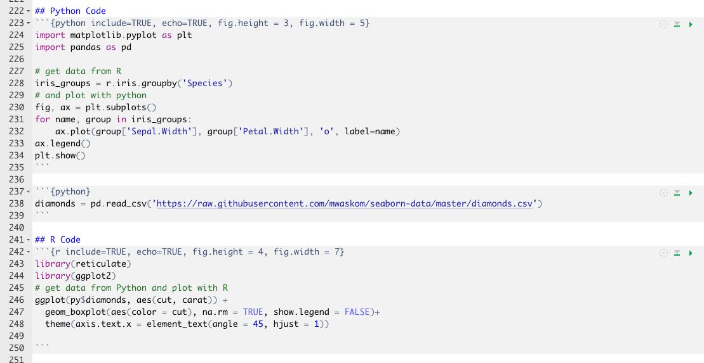

## Contents

- Background - why we are talking about it
- Ways of closing the gap
  + Feather
  + Apache Arrow
  + Ursa Labs
  + Rstudio 1.2 / reticulated python
- Conclusion

## Background

- There is an argument in the data science space
- Can be observed by countless articles / blog posts etc on R vs Python
- <strong>BUT</strong>: this argument is not very helpful and divisive
- Focus should be on the task at hand, not the tools
  + you can drill a hole with a hammer, but it won't be elegant
- Both tools have strengths and weaknesses (not part of this talk)
- You are here to solve a problem, not to have a favourite algorithm or tool
  
## Reality check {.columns-2}


KD Nuggets Poll 2018: most of the people who use Python or R use both 

\


<!--html_preserve-->
<table style="border-collapse:collapse;" class=table_4090 border=0>
<col width="150">
<col width="50">
<col width="50">
<thead>
<tr style="background-color:#428bca;">
  <th id="tableHTML_header_1"> </th>
  <th id="tableHTML_header_2">Total</th>
  <th id="tableHTML_header_3">Percent</th>
</tr>
</thead>
<tbody>
<tr>
  <td id="tableHTML_rownames">R or Python Users</td>
  <td id="tableHTML_column_1" style="text-align:right !important;text-align:center;">2094</td>
  <td id="tableHTML_column_2" style="text-align:right !important;text-align:center;">100 %</td>
</tr>
<tr style="background-color:#f2f2f2;">
  <td id="tableHTML_rownames">R and Python</td>
  <td id="tableHTML_column_1" style="text-align:right !important;text-align:center;">924</td>
  <td id="tableHTML_column_2" style="text-align:right !important;text-align:center;">44.13 %</td>
</tr>
<tr>
  <td id="tableHTML_rownames">R only</td>
  <td id="tableHTML_column_1" style="text-align:right !important;text-align:center;">578</td>
  <td id="tableHTML_column_2" style="text-align:right !important;text-align:center;">27.6 %</td>
</tr>
<tr style="background-color:#f2f2f2;">
  <td id="tableHTML_rownames">Python only</td>
  <td id="tableHTML_column_1" style="text-align:right !important;text-align:center;">592</td>
  <td id="tableHTML_column_2" style="text-align:right !important;text-align:center;">28.27%</td>
</tr>
</tbody>
</table><!--/html_preserve-->


## What Python and R have in common

- A lot of data science teams use both
- both languages have rich interfaces to C / C++
- most of under-the-hood coding is done in C / C++

\

<strong>Would it not make sense to aim for interoperability?</strong>

## Feather

- Python and R use data frames as a fundamental data structure
  + Pandas data frame are based on the idea of R's data frames
- Implemented after the announcement of Apache Arrow
  + Aim: share data between Python and R 
  + Use a binary file format for data frames
  + bridge time until Apache Arrow is implemented
- Uses the Apache Arrow columnar specification to represent binary data **on disk** (zero-copy access)
- Fast, lightweight, and easy-to-use binary file format for storing data frames.
- High read and write performance.


## Limitations of Feather

- Quickly exchange data between Python and R code, however it's not designed for long-term data storage.
- Supports limited scalar value types, adequate only for representing typical data found in R and pandas
- Supports only a single batch of rows (no ability to append to existing files)
- Only non-nested data types and categorical (dictionary-encoded) types are supported

## Apache Arrow
A standarised, language-independent representation of in-memory columnar data

- Exchange data without conversion between the different languages including python and R (also C, C++, C#, Go, Java, JavaScript, MATLAB, Ruby, and Rust.)
- Zero-copy dataflow
- Optimised for analytic purposes
- Supports flat and nested format and conveniently many native data types
- Backed by key developers of 13 major open source projects (including Cassandra, Hadoop, HBase, Parquet, Spark, ... )


## Apache Arrow

<!--html_preserve-->
<table style="border-collapse:collapse;" class=table_4340 border=1>
<caption id="footer" align="bottom">source: arrow.apache.org</caption>
<thead>
<tr style="border:1px solid transparent;">
  <th id="tableHTML_header_1" style="border:1px solid transparent;"></img></th>
  <th id="tableHTML_header_2" style="border:1px solid transparent;"></img></th>
</tr>
</thead>
<tbody>
<tr style="border:1px solid transparent;">
  <td id="tableHTML_column_1" style="border:1px solid transparent;"><ul> <li> Each system has its own internal memory format</td>
  <td id="tableHTML_column_2" style="border:1px solid transparent;"><ul> <li>All systems utilize the same memory format</td>
</tr>
<tr style="border:1px solid transparent;">
  <td id="tableHTML_column_1" style="border:1px solid transparent;"><ul> <li> 70-80% computation wasted on serialization and deserialization</td>
  <td id="tableHTML_column_2" style="border:1px solid transparent;"><ul> <li>No overhead for cross-system communication</td>
</tr>
<tr style="border:1px solid transparent;">
  <td id="tableHTML_column_1" style="border:1px solid transparent;"><ul> <li> Similar functionaltiy implemented in multiple projects</td>
  <td id="tableHTML_column_2" style="border:1px solid transparent;"><ul> <li>Projects can share functionality</td>
</tr>
<tr style="border:1px solid transparent;">
  <td id="tableHTML_column_1" style="border:1px solid transparent;"></td>
  <td id="tableHTML_column_2" style="border:1px solid transparent;"></td>
</tr>
</tbody>
</table><!--/html_preserve-->


## Ursa Labs

When to comes to the most fundamental tasks (data access, data manipulation, data analysis, ……. ), data science tools are not optimised to make use of state-of-the-art hardware, as the efforts has been mainly focused on machine learning problems.

- Ursa Labs is an organisation founded 
  + by Wes McKinney (and Hadley Wickham as advisor for R)
  + with the goal of advancing open source, cross-language software for data scientists
- Focuses on the data science tools of the Apache Arrow Project (Arrow has a broader application scope) 
- May expand to create software artifacts focused more specifically on the data science domain


## Rstudio 1.2 / reticulated python {.smaller}
### The package: reticulate
- Reticulate is an R package that makes it possible to embed a Python session within an R process.
- Provides wrapper functions to use python modules and scripts
    + import, python_source, repl_python, use_python, py_install, …… 
- Data conversion back and forth between the two languages happens through C++
- R and Python variables are accessible from both environments
    + The objects  py and r provide this access

## Rstudio 1.2 / reticulated python {.smaller}
### The IDE: Rstudio 1.2
- Automatic access to a python REPL when stepping into a python script
  + read–eval–print loop 
  + interactive language shell
  + simple, interactive computer programming environment 
- Line-by-line execution of Python code
- Support for Python syntax highlighting
- Autocompletion and Inline help for Python ...... HOOORAY!!!  
- R notebooks with Python code chunks
- Automatic switch in the code history pane between Python and R
- Sourcing full Python scripts
- Display of matplotlib plots within the plots pane in RStudio and inline in the notebooks

## Type conversion

<!-- -->

## R Notebooks


## Python Code 

```python
import matplotlib.pyplot as plt
import pandas as pd

# get data from R
iris_groups = r.iris.groupby('Species')
# and plot with python
fig, ax = plt.subplots()
for name, group in iris_groups:
    ax.plot(group['Sepal.Width'], group['Petal.Width'], 'o', label=name)
ax.legend()
plt.show()
```


## R Code

```r
library(reticulate)
library(ggplot2)
# get data from Python and plot with R
ggplot(py$diamonds, aes(cut, carat)) +
  geom_boxplot(aes(color = cut), na.rm = TRUE, show.legend = FALSE)+
  theme(axis.text.x = element_text(angle = 45, hjust = 1))
```

<!-- -->

## Is RStudio a good alternative as a Python IDE?

- It makes switching from R to Python certainly easier
- It supports syntax highlighting and autocomplete
- It is not intended as a Python IDE (yet?)
- Since it's slightly painful, it's probably a Python IDE for data science though ;)

## Conclusion

- R <strong>*vs*</strong> Python is now R <strong>*and*</strong> Python
    + It's not about the tool, it's about the task at hand
- There are many initiatives to bring the tools closer together
    + Ursa labs => Apache Arrow
    + RStudio => Python integration
- The dogmatic war was boring before it started
- This is the time to start to embrace the strengths of the tools and to collaborate

# Questions?

## Sources
https://towardsdatascience.com/from-r-vs-python-to-r-and-python-aa25db33ce17
https://www.kdnuggets.com/2017/06/ecosystem-data-science-machine-learning-software.html/2
http://ursalabs.org/tech/
http://wesmckinney.com/blog/feather-arrow-future/
https://arrow.apache.org/

